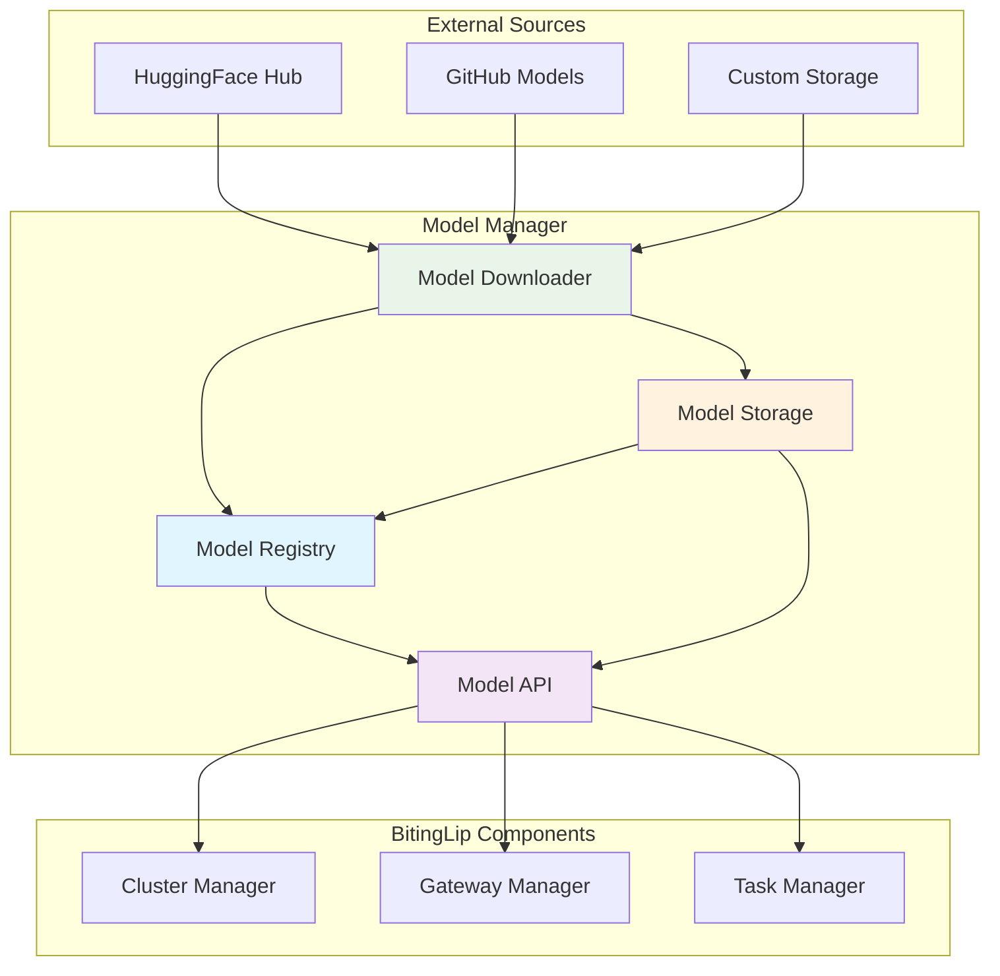
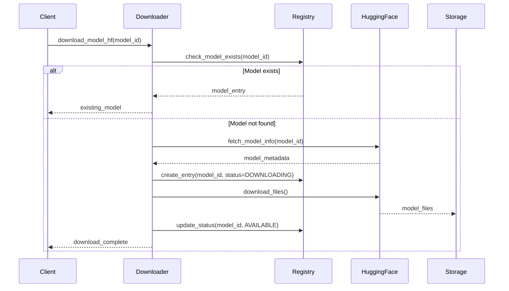

# Model Manager Architecture

## Overview

The Model Manager is responsible for the complete lifecycle management of AI/ML models within the BitingLip system. It provides centralized storage, downloading, registry management, and serves as the authoritative source for model availability across the platform.

## System Design



## Core Components

### Model Registry (`registry.py`)

**Purpose**: Maintains metadata and status of all available models

**Key Features**:
- Model metadata storage (name, type, version, size, status)
- JSON-based persistence
- Query and filtering capabilities
- Status tracking (downloading, available, error, deleted)

**Data Schema**:
```python
@dataclass
class ModelEntry:
    model_id: str
    model_type: ModelType
    path: Path
    status: ModelStatus
    version: str
    size_bytes: int
    download_date: datetime
    metadata: Dict[str, Any]
```

### Model Downloader (`downloader.py`)

**Purpose**: Handles downloading models from various sources

**Key Features**:
- HuggingFace Hub integration with `huggingface_hub` library
- Progress tracking and resumable downloads
- Checksum validation and integrity checks
- Error handling and retry logic
- Selective file downloading

**Download Flow**:


### Model Storage (`models/`)

**Purpose**: Organized file system storage for model data

**Structure**:
```
models/
├── model_registry.json           # Registry metadata
├── huggingface/                  # HuggingFace models
│   ├── gpt2/                     # Model namespace
│   │   ├── config.json
│   │   ├── tokenizer.json
│   │   ├── pytorch_model.bin
│   │   └── special_tokens_map.json
│   └── stable-diffusion-v1-5/
├── custom/                       # Custom model uploads
└── cache/                        # Temporary download cache
```

**Storage Features**:
- Namespace isolation by source and model
- Atomic downloads with temporary staging
- Configurable storage paths
- Automatic cleanup of failed downloads

### Model API (Future)

**Purpose**: RESTful API for model operations

**Planned Endpoints**:
- `GET /models` - List available models
- `GET /models/{model_id}` - Get model details
- `POST /models/download` - Request model download
- `DELETE /models/{model_id}` - Remove model
- `GET /models/{model_id}/files` - List model files
- `GET /models/{model_id}/status` - Get download status

## Data Models

### ModelType Enum
```python
class ModelType(str, Enum):
    TEXT_GENERATION = "text-generation"
    TEXT_TO_IMAGE = "text-to-image"
    IMAGE_TO_TEXT = "image-to-text"
    AUDIO_TO_TEXT = "audio-to-text"
    TEXT_TO_AUDIO = "text-to-audio"
    EMBEDDING = "embedding"
    CLASSIFICATION = "classification"
    OTHER = "other"
```

### ModelStatus Enum
```python
class ModelStatus(str, Enum):
    DOWNLOADING = "downloading"
    AVAILABLE = "available"
    ERROR = "error"
    DELETED = "deleted"
    PENDING = "pending"
```

## Integration Architecture

### With Cluster Manager
- Provides model file paths for worker node loading
- Shares model availability status
- Handles model distribution strategies

### With Gateway Manager
- Reports model availability for request routing
- Provides model metadata for task validation
- Supports model recommendation logic

### With Task Manager
- Enables model-specific task queuing
- Provides model requirements for task scheduling
- Supports model performance metrics

## Configuration Management

### Environment Variables
```bash
# Storage Configuration
MODEL_STORAGE_DIR=/opt/models
MODEL_REGISTRY_FILE=/opt/models/registry.json

# HuggingFace Configuration
HF_TOKEN=hf_xxxxxxxxxxxxxxxxxxxx
HF_HUB_CACHE=/opt/cache/huggingface

# Download Configuration
MAX_CONCURRENT_DOWNLOADS=3
DOWNLOAD_TIMEOUT=3600
VERIFY_CHECKSUMS=true

# API Configuration (when running as service)
MODEL_API_HOST=0.0.0.0
MODEL_API_PORT=8005
```

### Configuration Loading
```python
from pydantic import BaseSettings

class ModelManagerConfig(BaseSettings):
    model_storage_dir: Path = Path("./models")
    model_registry_file: Path = Path("./models/registry.json")
    hf_token: Optional[str] = None
    max_concurrent_downloads: int = 3
    download_timeout: int = 3600
    verify_checksums: bool = True
    
    class Config:
        env_file = ".env"
```

## Security Considerations

### Access Control
- File system permissions for model storage
- API authentication when running as service
- HuggingFace token management

### Data Integrity
- Checksum validation for downloads
- Atomic file operations
- Backup and recovery procedures

### Privacy
- Model metadata sanitization
- Secure token storage
- Audit logging for model access

## Performance Optimization

### Caching Strategy
- In-memory model metadata caching
- Lazy loading of large model files
- LRU eviction for storage management

### Download Optimization
- Parallel chunk downloading
- Resume interrupted downloads
- Bandwidth throttling options

### Storage Optimization
- Compression for inactive models
- Deduplication of common files
- Tiered storage (SSD/HDD) support
